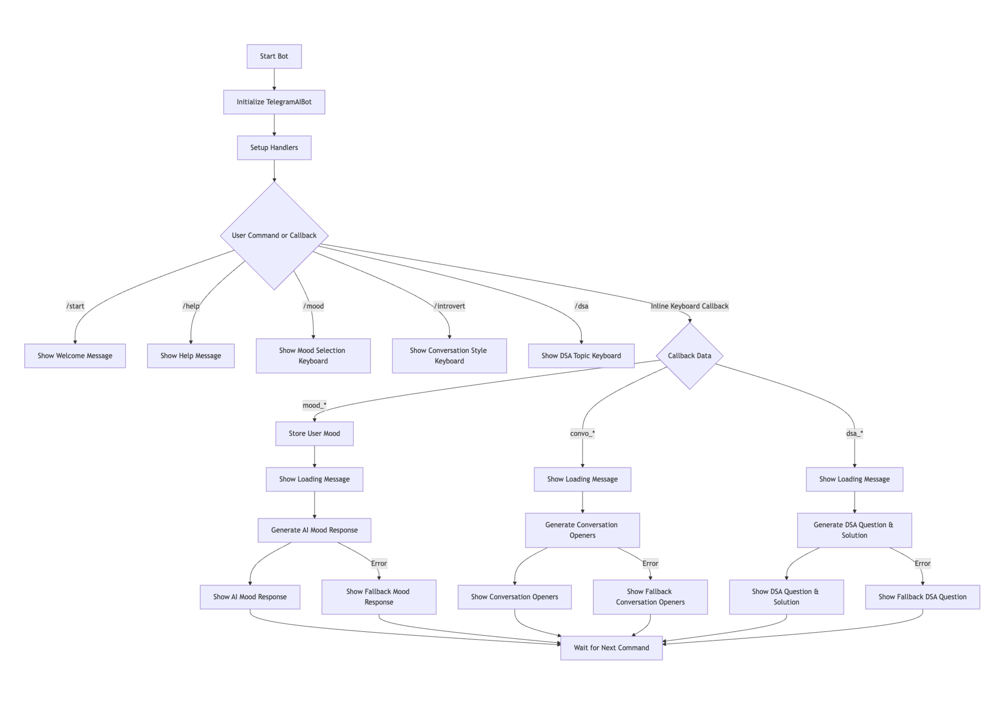

# Telegram AI Bot

A Telegram bot that provides personalized mood-based suggestions, conversation openers for introverts, and Data Structures & Algorithms (DSA) practice questions using AI (Databricks Llama 3).

## Features

- **Mood Suggestions:** Select your current mood and get AI-generated advice, jokes, or activities.
- **Introvert Conversation Starters:** Get conversation openers in various styles (casual, playful, intellectual, etc.).
- **DSA Practice:** Practice DSA topics with interactive questions and solutions.
- **Fallbacks:** If AI is unavailable, the bot provides helpful fallback responses.

## Flowchart



## Demo
[![Watch the demo]<iframe width="560" height="315" src="https://www.youtube.com/embed/YmLPPfxwxNA?si=Q2acexyAd08M4AvZ" title="YouTube video player" frameborder="0" allow="accelerometer; autoplay; clipboard-write; encrypted-media; gyroscope; picture-in-picture; web-share" referrerpolicy="strict-origin-when-cross-origin" allowfullscreen></iframe>

## Commands

- `/start` - Welcome message and introduction
- `/mood` - Select your current mood and get personalized AI response
- `/introvert` - Get conversation starters for different social situations
- `/dsa` - Practice Data Structures & Algorithms with interactive problems
- `/help` - Show help message

## Setup

0. Create a Telegram Bot

   1. Open Telegram and search for [@BotFather](https://t.me/botfather).
   2. Start a chat and send `/newbot`.
   3. Follow the prompts to set your bot’s name and username.
   4. After creation, you’ll receive a **Bot Token** (e.g., `123456:ABC-DEF1234ghIkl-zyx57W2v1u123ew11`).  
      **Save this token**—you’ll need it for the next steps.

1. **Clone the repository:**
   ```sh
   git clone https://github.com/alamshoaib134/Telegram-bot.git
   cd telegram-ai-mood-bot
   ```

2. **Install dependencies:**
   ```sh
   pip install python-telegram-bot openai
   ```

3. **Configure API keys:**
   - Set your `TELEGRAM_BOT_TOKEN` and `DATABRICKS_TOKEN` in the script or use a `.env` file.

4. **Run the bot:**
   ```sh
   python Untitled-1.py
   ```

## Requirements

- Python 3.8+
- [python-telegram-bot](https://python-telegram-bot.org/)
- [openai](https://pypi.org/project/openai/)

## Notes

- This bot uses Databricks Llama 3 for AI responses.
- For production, use a secure method to store API keys and a proper database for user data.

---

*Created by [alamshoaib134](https://github.com/alamshoaib134)*
